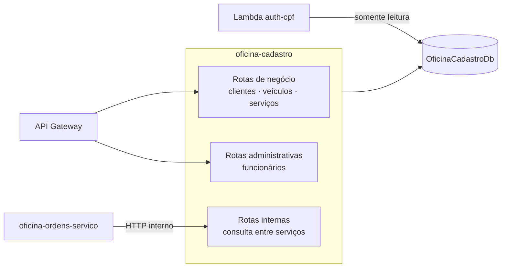

# oficina-cadastro

> Microsserviço de clientes, veículos, funcionários e catálogo de serviços da Oficina.
> **.NET 10** · **ASP.NET Core** · **EF Core / SQL Server** · **EKS** · **GitHub Actions**

---

## A solução

A **Oficina** é uma plataforma de gestão de oficina mecânica distribuída em **6 repositórios** que compõem um único sistema na AWS. O cliente acessa uma API Gateway que autentica na borda e encaminha o tráfego para três microsserviços .NET 10 em EKS, que se comunicam por HTTP e por filas SQS FIFO e persistem em um RDS SQL Server compartilhado.

| Repositório | Responsabilidade |
|---|---|
| [oficina-infra-db](https://github.com/fabianorodrigues/oficina-infra-db-fiap-fase4) | Rede, banco de dados, segredos e estado do Terraform |
| [oficina-infra](https://github.com/fabianorodrigues/oficina-infra-fiap-fase4) | Plataforma EKS e entrypoint de API |
| [oficina-auth-lambda](https://github.com/fabianorodrigues/oficina-auth-lambda-fiap-fase4) | Autenticação por CPF e emissão de token |
| **oficina-cadastro** *(este)* | Clientes, veículos, funcionários e catálogo de serviços |
| [oficina-estoque](https://github.com/fabianorodrigues/oficina-estoque-fiap-fase4) | Peças, insumos, saldos e reservas |
| [oficina-ordens-servico](https://github.com/fabianorodrigues/oficina-ordens-servico-fiap-fase4) | Ordens de serviço, orçamento e saga de pagamento |

---

## Ordem de deploy

| # | Repositório | Workflow | Confirmação |
|---|---|---|---|
| 1 | oficina-infra-db | Database Infrastructure Deploy | `APPLY` |
| 2 | oficina-infra | Platform Deploy | `APPLY` |
| 3 | oficina-infra-db | Database Bootstrap | `BOOTSTRAP` |
| 4 | oficina-auth-lambda | Auth Deploy | `DEPLOY` |
| **5** | **oficina-cadastro** · estoque · ordens-servico | **Deploy** | `DEPLOY` |
| 6 | oficina-infra | Entrypoint Deploy | `APPLY` |
| 7 | oficina-infra | Observability Validate | `VALIDATE` |
| 8 | oficina-ordens-servico | AWS E2E Validate | `VALIDATE` |

> Este repositório é uma das três publicações da **etapa 5**, que podem rodar em paralelo. Depende do cluster e do registro de imagem da etapa 2 e do banco criado na etapa 3.
>
> Não há dependência de deploy entre os três, mas **recomenda-se publicar este primeiro**: é ele que cria a tabela de funcionários usada pela autenticação e as rotas internas consultadas pelas ordens de serviço.

---

## Responsabilidade

Domínio de dados mestres da oficina:

- **Clientes** — pessoa física ou jurídica, com documento validado.
- **Veículos** — placa, RENAVAM e modelo, vinculados a um cliente.
- **Funcionários** — usuários internos, com perfil de acesso e senha. **É a tabela consultada pela autenticação.**
- **Catálogo de serviços** — cada serviço com mão de obra e a receita de peças e insumos que consome.

Não publica nem consome mensagens: é um serviço de consulta e escrita síncrona, chamado pela borda e pelas ordens de serviço.

---

## Arquitetura



Clean Architecture em quatro projetos: **Domain** (agregados e objetos de valor), **Application** (casos de uso, validações e portas), **Infrastructure** (EF Core, mapeamentos, repositórios e migrações) e **Api** (controladores, middlewares e segurança). As dependências apontam sempre para dentro.

---

## Autenticação

O token é validado pelo autorizador da API Gateway, que devolve as claims à borda. A API Gateway as converte em cabeçalhos de identidade (`x-oficina-user-id`, `x-oficina-user-cpf`, `x-oficina-user-role`, `x-oficina-user-name`) e os injeta na requisição encaminhada.

Este serviço materializa esses cabeçalhos como claims e aplica as políticas de autorização por perfil. Requisição sem identidade válida é rejeitada pela política padrão, que exige usuário autenticado; apenas `/health` e `/ready` são anônimos.

Os cabeçalhos são confiáveis porque o balanceador é interno e o acesso está restrito ao VPC Link — nenhum chamador externo alcança o serviço sem passar pela borda. Manter essa restrição é parte do modelo de segurança.

No perfil de desenvolvimento, um modo alternativo aceita cabeçalhos `X-Dev-*` para simular perfil e usuário sem token. Ele **só é ativado em desenvolvimento** — a aplicação lança erro se for solicitado em qualquer outro perfil.

---

## Endpoints

| Método | Rota | Perfil |
|---|---|---|
| `GET` `POST` | `/api/clientes` | Funcionário ou administrador |
| `GET` `PUT` | `/api/clientes/{id}` | Funcionário ou administrador |
| `GET` `POST` | `/api/veiculos` | Funcionário ou administrador |
| `GET` `PUT` | `/api/veiculos/{id}` | Funcionário ou administrador |
| `GET` `POST` | `/api/servicos` | Funcionário ou administrador |
| `GET` `PUT` | `/api/servicos/{id}` | Funcionário ou administrador |
| `GET` `POST` | `/api/admin/funcionarios` | Administrador |
| `GET` `PUT` | `/api/admin/funcionarios/{id}` | Administrador |
| `PATCH` | `/api/admin/funcionarios/{id}/alterar-senha` | Administrador |
| `PATCH` | `/api/admin/funcionarios/{id}/ativar` · `/inativar` | Administrador |
| `GET` | `/health` · `/ready` | Anônimo |

**Rotas internas** (`/api/internal/...`), consumidas apenas pelas ordens de serviço e **não publicadas na API Gateway**: consulta de cliente por identificador ou documento, de veículo por identificador ou placa, e consulta de serviços em lote.

`/health` responde de imediato; `/ready` verifica a conexão com o banco e responde indisponível se ela falhar.

---

## Contrato de integração

### Consome

| Valor | Origem | Criado por |
|---|---|---|
| Cluster e namespace | `/oficina/infra/cluster/{name,namespace}` | oficina-infra |
| Registro de imagem | `/oficina/infra/ecr/cadastro` | oficina-infra |
| Credencial de runtime | `/oficina/cadastro/runtime-db` | oficina-infra-db |
| Credencial de migração | `/oficina/cadastro/migration-db` | oficina-infra-db |

As credenciais são montadas no pod pelo driver CSI de segredos — **não passam por variável de ambiente nem por objeto Secret do Kubernetes**.

### Publica

Rotas HTTP no cluster, expostas pelo Ingress do repositório [oficina-infra](https://github.com/fabianorodrigues/oficina-infra-fiap-fase4), e o esquema do banco de cadastro, aplicado pelo Job de migração.

---

## Configuração

Configure em **Settings → Secrets and variables → Actions** do repositório.

| Tipo | Nome | Obrigatório |
|---|---|---|
| Secret | `AWS_ACCESS_KEY_ID` · `AWS_SECRET_ACCESS_KEY` · `AWS_SESSION_TOKEN` | **Sim** |
| Variable | `AWS_REGION` | **Sim** |

Não há mais nada a configurar neste repositório: cluster, namespace, registro de imagem e credenciais são descobertos em tempo de execução a partir do que as etapas anteriores publicaram.

### Variáveis de ambiente da aplicação

Definidas pelo ConfigMap do repositório; nenhuma precisa ser configurada no GitHub.

| Chave | Valor no ambiente publicado |
|---|---|
| `ASPNETCORE_ENVIRONMENT` | Produção |
| `ConnectionStrings__OficinaCadastroDb` | Montada pelo CSI a partir do segredo |
| `Database__ApplyMigrations` | Desativado — migrações rodam em Job próprio |
| `OpenTelemetry__Enabled` · `OpenTelemetry__OtlpEndpoint` | Instrumentação ativa, sem destino configurado |

A aplicação **recusa-se a iniciar** fora do perfil de desenvolvimento se a cadeia de conexão estiver vazia ou se o diretório de segredos não estiver montado.

---

## Executar pelo GitHub Actions

**Actions → Cadastro Deploy → Run workflow → `confirmation` = `DEPLOY`**

Roda apenas na branch `main`. Sequência: valida a requisição e a configuração → descobre cluster, namespace e registro de imagem → compila e testa → constrói as imagens de runtime e de migração → **varredura de vulnerabilidades, que interrompe o deploy em achado alto ou crítico** → envia ao registro → aplica os manifestos → **executa o Job de migração e aguarda sua conclusão** → aplica o Deployment e aguarda a substituição → teste de fumaça por encaminhamento de porta.

As imagens são marcadas com o hash do commit, nunca com uma tag móvel. Se o Job de migração falhar, o Deployment não é atualizado.

---

## Validar

### Pelo Console AWS

| Serviço | O que verificar |
|---|---|
| **ECR** | Repositório de cadastro com a imagem do commit publicado |
| **EKS → Recursos** | Deployment disponível e Job de migração concluído no namespace da aplicação |

### Pela CLI

<details>
<summary>Comandos de validação</summary>

```bash
REGIAO=<sua-regiao>
CLUSTER=$(aws ssm get-parameter --name /oficina/infra/cluster/name \
  --region "$REGIAO" --query 'Parameter.Value' --output text)
aws eks update-kubeconfig --name "$CLUSTER" --region "$REGIAO"

kubectl get deployment,pod -n oficina -l app.kubernetes.io/name=oficina-cadastro
kubectl get jobs -n oficina
kubectl logs -n oficina -l app.kubernetes.io/name=oficina-cadastro --tail=50

# Verificação de saúde sem expor o serviço
kubectl port-forward -n oficina svc/oficina-cadastro 18080:8080 &
curl -s http://localhost:18080/health
curl -s http://localhost:18080/ready
```

</details>

Após a **etapa 6**, a verificação de saúde também responde pela API pública, em `/health/cadastro`.

---

## Executar e validar localmente

O ambiente local completo — banco, filas e os três serviços — é orquestrado pelo repositório [oficina-ordens-servico](https://github.com/fabianorodrigues/oficina-ordens-servico-fiap-fase4), que constrói este serviço a partir do diretório vizinho. Consulte as instruções lá para subir a solução integrada.

Para trabalhar apenas neste repositório:

```bash
dotnet restore
dotnet build -c Release
dotnet test
```

Os testes cobrem regras de domínio e de aplicação, persistência (com banco em contêiner) e contratos públicos.

---

## Limitações conhecidas

- **Réplica única, sem escala automática**, por decisão de projeto.
- **Cobertura coletada mas sem limite mínimo.** Não há portão de qualidade que reprove queda de cobertura.
- **Artefatos de compilação versionados.** Diretórios de saída do build estão no repositório e deveriam ser ignorados.
- **Porta do serviço divergente.** Este serviço expõe a porta 8080 no cluster, enquanto os outros dois expõem a 80.

---

## Próxima etapa

Publique os demais serviços da **etapa 5**, se ainda não o fez:

- **→ [oficina-estoque](https://github.com/fabianorodrigues/oficina-estoque-fiap-fase4)**
- **→ [oficina-ordens-servico](https://github.com/fabianorodrigues/oficina-ordens-servico-fiap-fase4)**

Com os três no ar, siga para a **etapa 6** em [oficina-infra](https://github.com/fabianorodrigues/oficina-infra-fiap-fase4), que publica as rotas na API Gateway.
