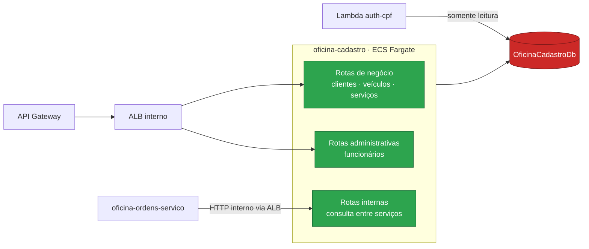

# oficina-cadastro

Microsserviço de **clientes, veículos, funcionários e catálogo de serviços** da solução **Oficina**.


---

## Sumário

- [Visão geral](#visão-geral)
- [Ordem de deploy da solução](#ordem-de-deploy-da-solução)
- [Arquitetura](#arquitetura)
- [Autenticação](#autenticação)
- [Endpoints](#endpoints)
- [O que consome e o que publica](#o-que-consome-e-o-que-publica)
- [Configuração](#configuração)
- [Como executar](#como-executar)
- [Validação](#validação)
- [Execução local](#execução-local)
- [Limitações conhecidas](#limitações-conhecidas)
- [Próximas etapas](#próximas-etapas)

---

## Visão geral

A **Oficina** é uma plataforma de gestão de oficina mecânica implantada na AWS e distribuída em **6 repositórios** que compõem um único sistema. O cliente acessa uma **API Gateway HTTP**, que autentica na borda por uma **Lambda authorizer** e encaminha o tráfego, via **VPC Link**, para um **ALB interno** que roteia para três microsserviços **.NET 10 em ECS Fargate**. Os serviços se comunicam por HTTP interno e por filas **SQS FIFO**, e persistem em um **RDS SQL Server** compartilhado.

| Repositório | Responsabilidade | Etapas |
|---|---|:---:|
| [oficina-infra-db](https://github.com/fabianorodrigues/oficina-infra-db-fiap-fase4) | Rede, banco de dados, segredos e estado do Terraform | 1 e 3 |
| [oficina-infra](https://github.com/fabianorodrigues/oficina-infra-fiap-fase4) | Plataforma ECS/ALB e entrada de API | 2, 6 e 7 |
| [oficina-auth-lambda](https://github.com/fabianorodrigues/oficina-auth-lambda-fiap-fase4) | Autenticação por CPF e validação de token | 4 |
| **oficina-cadastro** *(este)* | Clientes, veículos, funcionários e catálogo de serviços | 5 |
| [oficina-estoque](https://github.com/fabianorodrigues/oficina-estoque-fiap-fase4) | Peças, insumos, saldos e reservas | 5 |
| [oficina-ordens-servico](https://github.com/fabianorodrigues/oficina-ordens-servico-fiap-fase4) | Ordens de serviço, orçamento e saga de pagamento | 5 e 8 |

**Papel deste repositório:** domínio de dados mestres da oficina — clientes, veículos, funcionários (a tabela consultada pela autenticação) e catálogo de serviços com sua receita de peças e insumos. É um serviço de leitura e escrita síncrona; não publica nem consome mensagens.

---

## Ordem de deploy da solução

| # | Repositório | Workflow | Confirmação |
|:---:|---|---|:---:|
| 1 | oficina-infra-db | Database Infrastructure Deploy | `APPLY` |
| 2 | oficina-infra | Platform Deploy | `APPLY` |
| 3 | oficina-infra-db | Database Bootstrap | `BOOTSTRAP` |
| 4 | oficina-auth-lambda | Auth Deploy | `DEPLOY` |
| **5** | **oficina-cadastro** · estoque · ordens-servico | **Deploy** | `DEPLOY` |
| 6 | oficina-infra | Entrypoint Deploy | `APPLY` |
| 7 | oficina-infra | Observability Validate | — |
| 8 | oficina-ordens-servico | AWS E2E Validate | `VALIDATE` |

> [!IMPORTANT]
> Este é um dos três serviços da **etapa 5**, que podem rodar em paralelo. Depende do cluster e do registro de imagem da etapa 2 e do banco criado na etapa 3. Não há dependência de deploy entre os três, mas **recomenda-se publicar este primeiro**: ele cria a tabela de funcionários usada pela autenticação e as rotas internas consultadas pelas ordens de serviço.

---

## Arquitetura



Clean Architecture em quatro projetos: **Domain** (agregados e objetos de valor), **Application** (casos de uso, validações e portas), **Infrastructure** (EF Core, repositórios e migrações) e **Api** (controladores, middlewares e segurança). As dependências apontam sempre para dentro.

---

## Autenticação

O token é validado pelo autorizador da API Gateway, que devolve as *claims* à borda. A API Gateway as converte em cabeçalhos de identidade (`x-oficina-user-id`, `x-oficina-user-cpf`, `x-oficina-user-role`, `x-oficina-user-name`) e os injeta na requisição encaminhada.

Este serviço materializa esses cabeçalhos como *claims* e aplica as políticas de autorização por perfil. Requisição sem identidade válida é rejeitada; apenas `/health` e `/ready` são anônimos. Os cabeçalhos são confiáveis porque o ALB é interno e o acesso está restrito ao VPC Link. No perfil de desenvolvimento, um modo alternativo aceita cabeçalhos `X-Dev-*` para simular usuário sem token — **ativado apenas em desenvolvimento**.

---

## Endpoints

| Método | Rota | Perfil |
|---|---|---|
| `GET` `POST` | `/api/clientes` | Funcionário ou administrador |
| `GET` `PUT` | `/api/clientes/{id}` | Funcionário ou administrador |
| `GET` `POST` | `/api/veiculos` | Funcionário ou administrador |
| `GET` `PUT` | `/api/veiculos/{id}` | Funcionário ou administrador |
| `GET` `POST` | `/api/servicos` | Funcionário ou administrador |
| `GET` `PUT` | `/api/servicos/{id}` | Funcionário ou administrador |
| `GET` `POST` | `/api/admin/funcionarios` | Administrador |
| `GET` `PUT` `PATCH` | `/api/admin/funcionarios/{id}` · `/alterar-senha` · `/ativar` · `/inativar` | Administrador |
| `GET` | `/health` · `/ready` | Anônimo |

**Rotas internas** (`/api/internal/...`), consumidas apenas pelas ordens de serviço e **não publicadas na API Gateway**: consulta de cliente por identificador ou documento, de veículo por identificador ou placa, e de serviços em lote.

`/health` responde de imediato; `/ready` verifica a conexão com o banco.

---

## O que consome e o que publica

### Consome

| Valor | Origem | Criado por |
|---|---|---|
| Cluster, grupo de segurança e subnets das tasks | `/oficina/infra/cluster/name` · `/oficina/infra/ecs/task-security-group-id` · `/oficina/infra/subnets/private/{1,2}` | oficina-infra |
| Registro de imagem, target group e grupo de log | `/oficina/infra/ecr/cadastro` · `/oficina/infra/ecs/cadastro/{target-group-arn,log-group-name}` | oficina-infra |
| Credenciais de runtime e migração | `/oficina/cadastro/{runtime,migration}-db` | oficina-infra-db |

As credenciais são injetadas na task como **ECS secrets** a partir do Secrets Manager — não passam por variável de ambiente em texto claro.

### Publica

O serviço ECS Fargate registrado no *target group* do ALB e o esquema do banco de cadastro, aplicado por uma task de migração.

---

## Configuração

Configure em **Settings → Secrets and variables → Actions** do repositório.

| Tipo | Nome | Uso | Obrigatório |
|---|---|---|:---:|
| Secret | `AWS_ACCESS_KEY_ID` · `AWS_SECRET_ACCESS_KEY` · `AWS_SESSION_TOKEN` | Credenciais temporárias da AWS | **Sim** |
| Variable | `AWS_REGION` | Região dos recursos | **Sim** |
| Variable | `ECS_TASK_EXECUTION_ROLE_ARN` | Role de execução das tasks ECS | **Sim** |
| Variable | `ECS_TASK_ROLE_ARN` | Role de aplicação das tasks ECS | **Sim** |

### Papéis IAM das tasks ECS — não provisionados automaticamente

O deploy registra *task definitions* Fargate e reutiliza duas roles IAM que **precisam existir antes da etapa 5**. Nenhum workflow da solução as cria.

| Variable | Trust | Permissões mínimas |
|---|---|---|
| `ECS_TASK_EXECUTION_ROLE_ARN` | `ecs-tasks.amazonaws.com` | `AmazonECSTaskExecutionRolePolicy` e `secretsmanager:GetSecretValue` nos segredos `/oficina/cadastro/{runtime,migration}-db` |
| `ECS_TASK_ROLE_ARN` | `ecs-tasks.amazonaws.com` | Permissões de runtime da aplicação (o cadastro não usa SQS) |

> [!NOTE]
> É o **mesmo par de roles** usado pelo bootstrap (infra-db) e pelos serviços de estoque e ordens. Crie uma vez e reutilize; para estoque e ordens, a `ECS_TASK_ROLE_ARN` precisa adicionalmente das ações SQS.

### Variáveis de ambiente da aplicação

Definidas pelo deploy na *task definition*; nenhuma precisa ser configurada no GitHub.

| Chave | Valor no ambiente publicado |
|---|---|
| `ASPNETCORE_ENVIRONMENT` | `Production` |
| `ConnectionStrings__OficinaCadastroDb` | Injetada como ECS secret a partir do Secrets Manager |
| `Database__ApplyMigrations` | Desativado — migrações rodam em task própria |

A aplicação **recusa-se a iniciar** fora de desenvolvimento se a cadeia de conexão estiver vazia.

---

## Como executar

**Actions → Cadastro Deploy → Run workflow → `confirmation` = `DEPLOY`**

Roda apenas na branch `main`. Sequência: valida a requisição e as variáveis → descobre cluster, registro de imagem, *target group* e grupo de log → compila e testa → constrói as imagens de runtime e de migração → **varredura de vulnerabilidades, que interrompe o deploy em achado alto ou crítico** → envia ao ECR → **executa a task de migração (ECS Run Task) e aguarda seu encerramento** → registra a *task definition* de runtime → **cria ou atualiza o serviço ECS** e aguarda ficar estável → confirma que há pelo menos um destino saudável no ALB.

As imagens são marcadas com o hash do commit, nunca com uma tag móvel. Se a task de migração falhar, o serviço não é atualizado.

---

## Validação

### Pelo Console AWS

| Serviço | O que verificar |
|---|---|
| **ECR** | Repositório de cadastro com a imagem do commit publicado |
| **ECS → Serviços** | `oficina-cadastro` estável, com a task de runtime em execução |
| **ECS → Tasks** | Task de migração `oficina-cadastro-migration` encerrada com código 0 |
| **EC2 → Target Groups** | Destino do cadastro saudável |

### Pela AWS CLI

<details>
<summary>Comandos de validação</summary>

```bash
REGIAO=<sua-regiao>
CLUSTER=$(aws ssm get-parameter --name /oficina/infra/cluster/name \
  --region "$REGIAO" --query 'Parameter.Value' --output text)

aws ecs describe-services --cluster "$CLUSTER" --services oficina-cadastro \
  --region "$REGIAO" --query 'services[0].{Status:status,Desejado:desiredCount,Rodando:runningCount}' \
  --output table

TG=$(aws ssm get-parameter --name /oficina/infra/ecs/cadastro/target-group-arn \
  --region "$REGIAO" --query 'Parameter.Value' --output text)
aws elbv2 describe-target-health --target-group-arn "$TG" --region "$REGIAO" \
  --query 'TargetHealthDescriptions[].TargetHealth.State' --output text
```

</details>

Após a **etapa 6**, a verificação de saúde também responde pela API pública, em `/health/cadastro`.

---

## Execução local

O ambiente local completo — banco, filas e os três serviços — é orquestrado pelo repositório [oficina-ordens-servico](https://github.com/fabianorodrigues/oficina-ordens-servico-fiap-fase4), que constrói este serviço a partir do diretório vizinho. Consulte as instruções lá para subir a solução integrada.

Para trabalhar apenas neste repositório:

```bash
dotnet restore
dotnet build -c Release
dotnet test
```

Os testes cobrem regras de domínio e de aplicação, persistência (com banco em contêiner) e contratos públicos.

---

## Limitações conhecidas

- **Réplica única, sem escala automática**, por decisão de projeto.
- **Cobertura coletada, sem limite mínimo** de qualidade.
- **Emissão de token não acontece aqui.** Este serviço apenas mantém a tabela de funcionários; o login vive em [oficina-auth-lambda](https://github.com/fabianorodrigues/oficina-auth-lambda-fiap-fase4).

---

## Próximas etapas

Publique os demais serviços da **etapa 5**, se ainda não o fez:

- **→ [oficina-estoque](https://github.com/fabianorodrigues/oficina-estoque-fiap-fase4)**
- **→ [oficina-ordens-servico](https://github.com/fabianorodrigues/oficina-ordens-servico-fiap-fase4)**

Com os três no ar, siga para a **etapa 6** em [oficina-infra](https://github.com/fabianorodrigues/oficina-infra-fiap-fase4), que publica as rotas na API Gateway.
