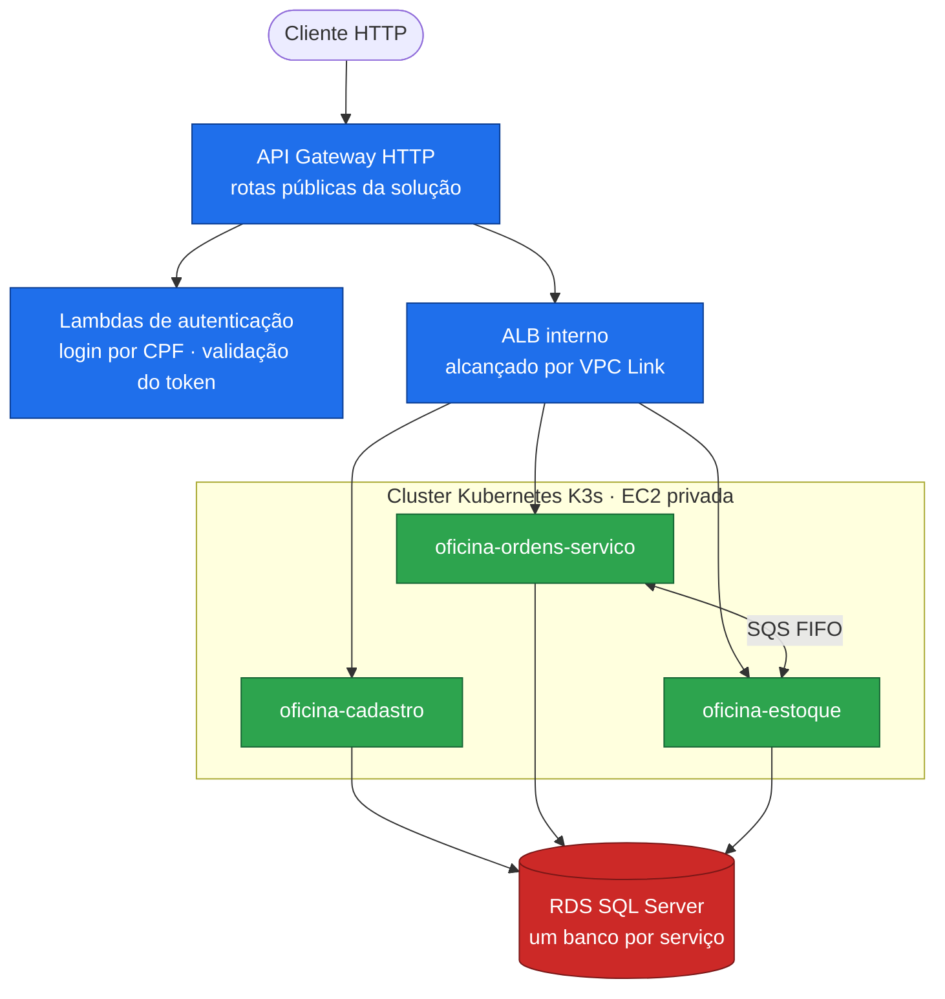
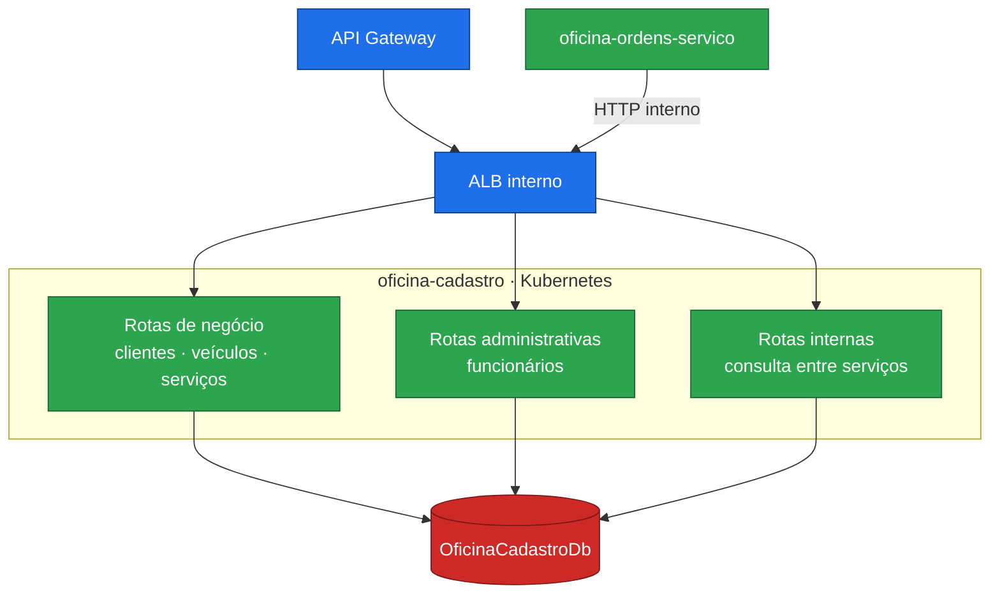

<h1 align="center">Oficina · Cadastro</h1>

<p align="center">
  Microsserviço de <strong>clientes, veículos, funcionários e catálogo de serviços</strong>
  da solução <strong>Oficina</strong>.
</p>

<p align="center">
  
  
</p>

<p align="center">
  
  
  
  
  
  
</p>

---

## Sumário

- [Responsabilidade](#responsabilidade)
- [Solução integrada](#solução-integrada)
- [Ordem de deploy](#ordem-de-deploy)
- [Arquitetura](#arquitetura)
- [Endpoints](#endpoints)
- [Pré-requisitos manuais](#pré-requisitos-manuais)
- [Contratos consumidos e publicados](#contratos-consumidos-e-publicados)
- [Como configurar](#como-configurar)
- [Como executar](#como-executar)
- [Como validar](#como-validar)
- [Ambiente local](#ambiente-local)
- [Observabilidade](#observabilidade)
- [Próxima etapa](#próxima-etapa)

---

## Responsabilidade

Domínio de dados mestres da oficina, publicado na **etapa 5**.

| Domínio | Conteúdo |
|---|---|
| Clientes | Cadastro e manutenção, com documento único |
| Veículos | Cadastro e manutenção, vinculados ao cliente e à placa |
| Funcionários | Tabela consultada pela autenticação, com perfil, situação e hash de senha |
| Catálogo de serviços | Serviços oferecidos e a respectiva receita de peças e insumos |

É um serviço de leitura e escrita síncrona: não publica nem consome mensagens. Suas migrations criam a tabela de funcionários, pré-requisito da etapa 6 e do login da solução.

---

## Solução integrada

A **Oficina** é uma plataforma de gestão de oficina mecânica implantada na AWS e distribuída em **6 repositórios que formam um único sistema**. O cliente acessa uma **API Gateway HTTP**, autenticada na borda por **Lambdas**; o tráfego segue por **VPC Link** até um **ALB interno**, que roteia para três microsserviços **.NET 10** em **Kubernetes (K3s)**. Os serviços conversam por HTTP interno e por **filas SQS FIFO**, e persistem em um **RDS SQL Server** com um banco isolado por serviço.


```mermaid
flowchart TB
    Cliente([Cliente HTTP])
    Gateway["API Gateway HTTP<br/>rotas públicas da solução"]
    Auth["Lambdas de autenticação<br/>login por CPF · validação do token"]
    ALB["ALB interno<br/>alcançado por VPC Link"]

    subgraph Cluster["Cluster Kubernetes K3s · EC2 privada"]
        direction LR
        Cadastro["oficina-cadastro"]
        Ordens["oficina-ordens-servico"]
        Estoque["oficina-estoque"]
    end

    Banco[("RDS SQL Server<br/>um banco por serviço")]

    Cliente --> Gateway
    Gateway --> Auth
    Gateway --> ALB
    ALB --> Cadastro
    ALB --> Ordens
    ALB --> Estoque
    Ordens <-->|"SQS FIFO"| Estoque
    Cadastro --> Banco
    Ordens --> Banco
    Estoque --> Banco

    classDef borda fill:#1f6feb,stroke:#0b3d91,color:#fff
    classDef servico fill:#2da44e,stroke:#166534,color:#fff
    classDef dados fill:#CC2927,stroke:#7a1717,color:#fff
    class Gateway,Auth,ALB borda
    class Cadastro,Ordens,Estoque servico
    class Banco dados
```

| Repositório | Responsabilidade | Etapas |
|---|---|:---:|
| [oficina-infra-db](https://github.com/fabianorodrigues/oficina-infra-db-fiap-fase4) | Rede, banco de dados, segredos, estado do Terraform e administrador inicial | 1 · 3 · 6 |
| [oficina-infra](https://github.com/fabianorodrigues/oficina-infra-fiap-fase4) | Plataforma Kubernetes/ALB, entrada pública da API e observabilidade | 2 · 9 · 10 |
| [oficina-auth-lambda](https://github.com/fabianorodrigues/oficina-auth-lambda-fiap-fase4) | Autenticação por CPF e validação de token na borda | 4 |
| **oficina-cadastro** *(este)* | Clientes, veículos, funcionários e catálogo de serviços | 5 |
| [oficina-estoque](https://github.com/fabianorodrigues/oficina-estoque-fiap-fase4) | Peças, insumos, saldos e reservas | 7 |
| [oficina-ordens-servico](https://github.com/fabianorodrigues/oficina-ordens-servico-fiap-fase4) | Ordens de serviço, orçamento e saga de pagamento | 8 · 11 |

---

## Ordem de deploy

| # | Repositório | Workflow | Confirmação |
|:---:|---|---|:---:|
| 1 | oficina-infra-db | Database Infrastructure Deploy | `APPLY` |
| 2 | oficina-infra | Platform Deploy | `APPLY` |
| 3 | oficina-infra-db | Database Bootstrap | `BOOTSTRAP` |
| 4 | oficina-auth-lambda | Auth Deploy | `DEPLOY` |
| **5** | **oficina-cadastro** *(este)* | **Cadastro Deploy** | `DEPLOY` |
| 6 | oficina-infra-db | Initial Admin Provision | `PROVISION_ADMIN` |
| 7 | oficina-estoque | Estoque Deploy | `DEPLOY` |
| 8 | oficina-ordens-servico | Ordens Deploy | `DEPLOY` |
| 9 | oficina-infra | Entrypoint Deploy | `APPLY` |
| 10 | oficina-infra | Observability Deploy | `DEPLOY` |
| 11 | oficina-ordens-servico | Collection Postman (manual) | — |

> [!IMPORTANT]
> Este é o primeiro dos três serviços. Depende do cluster e do registro de imagem da etapa 2 e do banco criado na etapa 3, e precede a etapa 6 porque suas migrations criam a tabela de funcionários.

---

## Arquitetura


```mermaid
flowchart TB
    Gateway["API Gateway"] --> ALB["ALB interno"]
    OrdensSvc["oficina-ordens-servico"] -->|"HTTP interno"| ALB

    subgraph Servico["oficina-cadastro · Kubernetes"]
        direction LR
        Negocio["Rotas de negócio<br/>clientes · veículos · serviços"]
        Admin["Rotas administrativas<br/>funcionários"]
        Interna["Rotas internas<br/>consulta entre serviços"]
    end

    ALB --> Negocio
    ALB --> Admin
    ALB --> Interna

    Negocio --> Banco[("OficinaCadastroDb")]
    Admin --> Banco
    Interna --> Banco

    classDef borda fill:#1f6feb,stroke:#0b3d91,color:#fff
    classDef servico fill:#2da44e,stroke:#166534,color:#fff
    classDef dados fill:#CC2927,stroke:#7a1717,color:#fff
    class Gateway,ALB borda
    class Negocio,Admin,Interna,OrdensSvc servico
    class Banco dados
```

Clean Architecture em quatro projetos: **Domain** (agregados e objetos de valor), **Application** (casos de uso, validações e portas), **Infrastructure** (EF Core, repositórios e migrations) e **Api** (controladores, middlewares e segurança). As dependências apontam sempre para dentro.

A Lambda de login consulta a tabela de funcionários deste banco com um login **somente leitura**, criado na etapa 3.

### Autenticação

O token é validado pelo autorizador na borda, e a API Gateway injeta as *claims* como cabeçalhos de identidade (`x-oficina-user-id`, `x-oficina-user-cpf`, `x-oficina-user-role`, `x-oficina-user-name`). Este serviço materializa esses cabeçalhos como *claims* e aplica as políticas de autorização por perfil.

Requisição sem identidade válida é rejeitada; apenas `/health` e `/ready` são anônimos. Os cabeçalhos são confiáveis porque o ALB é interno e o acesso está restrito ao VPC Link. No perfil de desenvolvimento existe um modo alternativo, que aceita cabeçalhos `X-Dev-*` para simular usuário sem token.

---

## Endpoints

| Método | Rota | Perfil |
|---|---|---|
| `GET` `POST` | `/api/clientes` | Funcionário ou administrador |
| `GET` `PUT` | `/api/clientes/{id}` | Funcionário ou administrador |
| `GET` `POST` | `/api/veiculos` | Funcionário ou administrador |
| `GET` `PUT` | `/api/veiculos/{id}` | Funcionário ou administrador |
| `GET` `POST` | `/api/servicos` | Funcionário ou administrador |
| `GET` `PUT` | `/api/servicos/{id}` | Funcionário ou administrador |
| `GET` `POST` | `/api/admin/funcionarios` | Administrador |
| `GET` `PUT` `PATCH` | `/api/admin/funcionarios/{id}` · `/alterar-senha` · `/ativar` · `/inativar` | Administrador |
| `GET` | `/health` · `/ready` | Anônimo |

**Rotas internas** (`/api/internal/...`), consumidas apenas pelas ordens de serviço e **não publicadas na API Gateway**: consulta de cliente por identificador ou documento, de veículo por identificador ou placa, e de serviços em lote.

`/health` reflete apenas o processo; `/ready` verifica a conexão com o banco e é o health check usado pelo target group do ALB.

---

## Pré-requisitos manuais

| Pré-requisito | Onde configurar | Comportamento sem configuração |
|---|---|---|
| Credenciais temporárias da AWS | Secrets deste repositório | O workflow falha na autenticação |
| Região da AWS | Variable `AWS_REGION` | O workflow aborta na validação inicial |
| Etapas 2 e 3 concluídas | [oficina-infra](https://github.com/fabianorodrigues/oficina-infra-fiap-fase4) e [oficina-infra-db](https://github.com/fabianorodrigues/oficina-infra-db-fiap-fase4) | O deploy falha ao resolver cluster, registro de imagem ou credenciais de banco |
| Instance profile da EC2 do cluster | Variable `INSTANCE_PROFILE_NAME`, em [oficina-infra](https://github.com/fabianorodrigues/oficina-infra-fiap-fase4#pré-requisitos-manuais) | Nenhum workflow da solução cria ou altera recursos IAM |

**Nenhuma role é passada por este deploy.** Os Pods herdam a role do instance profile da EC2, que precisa permitir: registro no Systems Manager, `ecr:GetAuthorizationToken` e leitura das imagens, `secretsmanager:GetSecretValue` nos segredos `/oficina/cadastro/{runtime,migration}-db` e `ssm:GetParameter` com `kms:Decrypt` no prefixo `/oficina/deploy/`.

> [!NOTE]
> Sem IRSA e sem Pod Identity, todos os Pods do namespace compartilham essa role. É uma limitação assumida do ambiente single-node.

---

## Contratos consumidos e publicados

### Consome

| Valor | Caminho | Criado por |
|---|---|---|
| Node do cluster e namespace | `/oficina/infra/k8s/{instance-id,namespace}` | oficina-infra |
| Registro de imagem | `/oficina/infra/ecr/cadastro` | oficina-infra |
| Target group e NodePort | `/oficina/infra/services/cadastro/{target-group-arn,node-port}` | oficina-infra |
| Credenciais de runtime e migração | `/oficina/cadastro/{runtime,migration}-db` | oficina-infra-db |

As credenciais são lidas do Secrets Manager **dentro da EC2** e materializadas como **Secrets Kubernetes** distintos — um para o Deployment e outro para o Migration Job. Nenhum valor secreto passa pelo runner do GitHub, pelo S3 ou como parâmetro de Run Command.

### Publica

Deployment e Service NodePort registrados no target group do ALB, e o esquema do banco de cadastro, aplicado por um Migration Job identificado pelo commit.

---

## Como configurar

Configure em **Settings → Secrets and variables → Actions** deste repositório.

| Tipo | Nome | Uso | Obrigatório |
|---|---|---|:---:|
| Secret | `AWS_ACCESS_KEY_ID` · `AWS_SECRET_ACCESS_KEY` · `AWS_SESSION_TOKEN` | Credenciais temporárias da AWS | **Sim** |
| Variable | `AWS_REGION` | Região dos recursos | **Sim** |
| Secret | `SONAR_TOKEN` | Token de análise do SonarCloud | Não |
| Variable | `SONAR_PROJECT_KEY` · `SONAR_ORGANIZATION` | Projeto e organização no SonarCloud | **Sim, se `SONAR_TOKEN` existir** |
| Variable | `TF_STATE_BUCKET` | Bucket alternativo para o pacote de manifests | Não |

Sem `SONAR_TOKEN`, a análise de qualidade é ignorada e o **gate local de cobertura continua obrigatório**. Com o token presente e sem projeto ou organização, o workflow falha: token configurado pela metade é engano de configuração, não motivo para pular a análise em silêncio.

### Variáveis de ambiente da aplicação

Definidas pelo deploy no ConfigMap e nos Secrets do namespace. **Nenhuma precisa ser configurada no GitHub.**

| Chave | Valor no ambiente publicado |
|---|---|
| `ASPNETCORE_ENVIRONMENT` | `Production` |
| `ConnectionStrings__OficinaCadastroDb` | Secret Kubernetes materializado dentro da EC2 |
| `Database__ApplyMigrations` | Desativado — as migrations rodam em Job próprio |
| `OTEL_EXPORTER_OTLP_ENDPOINT` | Endereço interno do Collector |
| `OTEL_SERVICE_VERSION` | Commit resolvido no deploy |
| `OTEL_RESOURCE_ATTRIBUTES` | Ambiente, namespace e nome do cluster |

O nome do serviço vem do código, evitando uma segunda fonte no ConfigMap. Nenhuma credencial da New Relic é entregue ao Pod, e a validação de configuração reprova o deploy se alguma aparecer. A aplicação **recusa-se a iniciar** fora de desenvolvimento se a cadeia de conexão estiver vazia.

---

## Como executar

**Actions → Cadastro Deploy → Run workflow → `confirmation` = `DEPLOY`**

Roda apenas na branch `main`.

| Fase | O que acontece |
|---|---|
| Qualidade | Valida o contrato de configuração, compila, executa os testes com cobertura, aplica o **gate local de 80%** e, quando configurado, o Quality Gate do SonarCloud |
| Imagens | Descobre registro, node, target group e NodePort, constrói as imagens de runtime e de migração e as marca com o commit — nunca com tag móvel |
| Segurança | Varredura de vulnerabilidades que **interrompe o deploy** em achado alto ou crítico, antes do envio ao ECR |
| Publicação | Transporta o pacote de manifests, aplica ConfigMap, Secrets, Migration Job, Deployment e Service, acompanha o rollout e confere a capacidade do node |
| Confirmação | Verifica que o destino ficou saudável no target group |

Se o Migration Job falhar, o Deployment e o Service não são aplicados.

A entrada opcional `transport` define como o pacote de manifests chega ao node: `s3` (padrão, por URL pré-assinada) ou `ssm` (alternativa quando o bucket não estiver disponível).

---

## Como validar

### Pelo Console AWS

| Serviço | O que verificar |
|---|---|
| **ECR** | Repositório de cadastro com a imagem do commit publicado |
| **EC2 → Instâncias** | Node do cluster `running` e `Online` no Systems Manager |
| **Systems Manager → Run Command** | Comandos de publicação com status `Success` |
| **EC2 → Target Groups** | Destino do cadastro saudável |

### Pela AWS CLI

<details>
<summary>Comandos de validação</summary>

```bash
REGIAO=<sua-regiao>

# Node do cluster respondendo pelo Systems Manager
INSTANCIA=$(aws ssm get-parameter --name /oficina/infra/k8s/instance-id \
  --region "$REGIAO" --query 'Parameter.Value' --output text)
aws ssm describe-instance-information --filters "Key=InstanceIds,Values=$INSTANCIA" \
  --region "$REGIAO" --query 'InstanceInformationList[0].PingStatus' --output text

# Saúde do destino no ALB
TG=$(aws ssm get-parameter --name /oficina/infra/services/cadastro/target-group-arn \
  --region "$REGIAO" --query 'Parameter.Value' --output text)
aws elbv2 describe-target-health --target-group-arn "$TG" --region "$REGIAO" \
  --query 'TargetHealthDescriptions[].TargetHealth.State' --output text
```

</details>

Após a etapa 9, a verificação de saúde também responde pela API pública, em `/health/cadastro`.

---

## Ambiente local

O ambiente local completo — banco, filas emuladas e os três serviços — é orquestrado por [oficina-ordens-servico](https://github.com/fabianorodrigues/oficina-ordens-servico-fiap-fase4#ambiente-local), que constrói este serviço a partir do diretório vizinho. É o caminho recomendado para exercitar a solução integrada.

Para trabalhar apenas neste repositório:

```bash
dotnet restore
dotnet build -c Release
dotnet test
```

### Cobertura de testes

| Item | Valor |
|---|---|
| Cobertura de linhas | **85,40%** (462/541 linhas) |
| Gate exigido pela CI | 80% |
| Comando | `dotnet test Oficina.Cadastro.sln --configuration Release --settings .runsettings --collect:"XPlat Code Coverage"` |
| Configuração | [`.runsettings`](.runsettings) e [`.github/workflows/ci.yml`](.github/workflows/ci.yml) |

A CI publica o relatório como artefato de execução. Os testes cobrem regras de domínio e de aplicação, persistência com banco em contêiner e contratos públicos.

---

## Observabilidade

Telemetria por OpenTelemetry, com um único Collector no cluster. O serviço envia traces e métricas por OTLP gRPC ao gateway interno e escreve logs JSON no stdout, coletados pelo receiver `filelog` — a aplicação não exporta log por OTLP, para não entregar o mesmo registro por dois caminhos.

Campos no nível superior de cada log:

```
timestamp, level, message, service.name, service.version, deployment.environment,
correlationId, trace.id, span.id
```

A proteção de dados combina uma allowlist de chaves nos atributos estruturados com sanitização do texto da mensagem e da exceção. Instrumentação ativa: ASP.NET Core, HttpClient, SqlClient e runtime .NET; `/ready` fica fora dos traces por ser consultado a cada poucos segundos pelo kubelet.

**Fail-open:** falha do Collector ou da New Relic registra erro local e o serviço continua atendendo.

Dashboard, alertas e monitores sintéticos são provisionados pela etapa 10, em [oficina-infra](https://github.com/fabianorodrigues/oficina-infra-fiap-fase4#observabilidade).

---

## Próxima etapa

**Etapa 6 — obrigatória no primeiro provisionamento.** Pré-condição: Deployment disponível no cluster, Migration Job concluído e destino saudável no target group.

**→ [oficina-infra-db](https://github.com/fabianorodrigues/oficina-infra-db-fiap-fase4#etapa-6)** — o **Initial Admin Provision** transforma os secrets do administrador em um funcionário real no banco. Sem ele, a validação funcional da etapa 11 não consegue autenticar.

Em seguida siga para a **etapa 7** em [oficina-estoque](https://github.com/fabianorodrigues/oficina-estoque-fiap-fase4).
