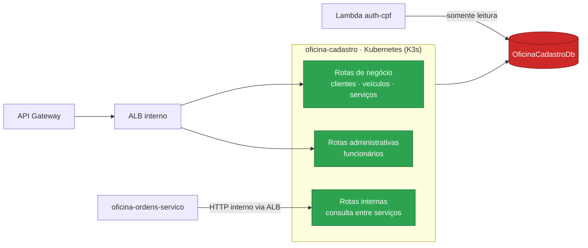

# oficina-cadastro


Microsserviço de **clientes, veículos, funcionários e catálogo de serviços** da solução **Oficina**.


---

## Sumário

- [Visão geral](#visão-geral)
- [Ordem de deploy da solução](#ordem-de-deploy-da-solução)
- [Arquitetura](#arquitetura)
- [Autenticação](#autenticação)
- [Endpoints](#endpoints)
- [O que consome e o que publica](#o-que-consome-e-o-que-publica)
- [Configuração](#configuração)
- [Como executar](#como-executar)
- [Validação](#validação)
- [Execução local](#execução-local)
- [Observabilidade](#observabilidade)
- [Limitações conhecidas](#limitações-conhecidas)
- [Próxima etapa](#próxima-etapa)

---

## Visão geral

A **Oficina** é uma plataforma de gestão de oficina mecânica implantada na AWS e distribuída em **6 repositórios** que compõem um único sistema. O cliente acessa uma **API Gateway HTTP**, que autentica na borda por uma **Lambda authorizer** e encaminha o tráfego, via **VPC Link**, para um **ALB interno** que roteia para três microsserviços **.NET 10 em Kubernetes (K3s single-node numa EC2 privada)**. Os serviços se comunicam por HTTP interno e por filas **SQS FIFO**, e persistem em um **RDS SQL Server** compartilhado.

| Repositório | Responsabilidade | Etapas |
|---|---|:---:|
| [oficina-infra-db](https://github.com/fabianorodrigues/oficina-infra-db-fiap-fase4) | Rede, banco de dados, segredos, estado do Terraform e admin inicial | 1, 3 e 5.1 |
| [oficina-infra](https://github.com/fabianorodrigues/oficina-infra-fiap-fase4) | Plataforma Kubernetes/ALB e entrada de API | 2 e 8 |
| [oficina-auth-lambda](https://github.com/fabianorodrigues/oficina-auth-lambda-fiap-fase4) | Autenticação por CPF e validação de token | 4 |
| **oficina-cadastro** *(este)* | Clientes, veículos, funcionários e catálogo de serviços | 5 |
| [oficina-estoque](https://github.com/fabianorodrigues/oficina-estoque-fiap-fase4) | Peças, insumos, saldos e reservas | 6 |
| [oficina-ordens-servico](https://github.com/fabianorodrigues/oficina-ordens-servico-fiap-fase4) | Ordens de serviço, orçamento e saga de pagamento | 7 e 9 |

**Papel deste repositório:** domínio de dados mestres da oficina — clientes, veículos, funcionários (a tabela consultada pela autenticação) e catálogo de serviços com sua receita de peças e insumos. É um serviço de leitura e escrita síncrona; não publica nem consome mensagens.

---

## Ordem de deploy da solução

| # | Repositório | Workflow | Confirmação |
|:---:|---|---|:---:|
| 1 | oficina-infra-db | Database Infrastructure Deploy | `APPLY` |
| 2 | oficina-infra | Platform Deploy | `APPLY` |
| 3 | oficina-infra-db | Database Bootstrap (estrutura) | `BOOTSTRAP` |
| 4 | oficina-auth-lambda | Auth Deploy | `DEPLOY` |
| **5** | **oficina-cadastro** | **Cadastro Deploy** | `DEPLOY` |
| 5.1 | oficina-infra-db | Initial Admin Provision | `PROVISION_ADMIN` |
| 6 | oficina-estoque | Estoque Deploy | `DEPLOY` |
| 7 | oficina-ordens-servico | Ordens Deploy | `DEPLOY` |
| 8 | oficina-infra | Entrypoint Deploy | `APPLY` |
| 9 | oficina-ordens-servico | Collection Postman (execução manual) | — |

Após a etapa 8, o **Observability Validate** (oficina-infra) está disponível como validação **opcional**.

> [!IMPORTANT]
> Este é o primeiro dos três serviços. Depende do cluster e do registro de imagem da etapa 2 e do banco criado na etapa 3. Ele vem antes da etapa **5.1** porque suas migrations criam `dbo.Funcionarios`, tabela usada pelo bootstrap do administrador inicial e pela autenticação. As etapas 6 e 7 não dependem desse admin para publicar os workloads, mas a etapa 9 depende dele para fazer login.

---

## Arquitetura


```mermaid
flowchart LR
    subgraph Cadastro["oficina-cadastro · Kubernetes (K3s)"]
        direction TB
        Pub["Rotas de negócio<br/>clientes · veículos · serviços"]
        Adm["Rotas administrativas<br/>funcionários"]
        Int["Rotas internas<br/>consulta entre serviços"]
    end

    API["API Gateway"] --> ALB["ALB interno"]
    ALB --> Pub
    ALB --> Adm
    Ordens["oficina-ordens-servico"] -->|"HTTP interno via ALB"| Int
    Cadastro --> DB[("OficinaCadastroDb")]
    Auth["Lambda auth-cpf"] -->|"somente leitura"| DB

    classDef svc fill:#2da44e,stroke:#166534,color:#fff
    classDef data fill:#CC2927,stroke:#7a1717,color:#fff
    class Pub,Adm,Int svc
    class DB data
```

Clean Architecture em quatro projetos: **Domain** (agregados e objetos de valor), **Application** (casos de uso, validações e portas), **Infrastructure** (EF Core, repositórios e migrações) e **Api** (controladores, middlewares e segurança). As dependências apontam sempre para dentro.

---

## Autenticação

O token é validado pelo autorizador da API Gateway, que devolve as *claims* à borda. A API Gateway as converte em cabeçalhos de identidade (`x-oficina-user-id`, `x-oficina-user-cpf`, `x-oficina-user-role`, `x-oficina-user-name`) e os injeta na requisição encaminhada.

Este serviço materializa esses cabeçalhos como *claims* e aplica as políticas de autorização por perfil. Requisição sem identidade válida é rejeitada; apenas `/health` e `/ready` são anônimos. Os cabeçalhos são confiáveis porque o ALB é interno e o acesso está restrito ao VPC Link. No perfil de desenvolvimento, um modo alternativo aceita cabeçalhos `X-Dev-*` para simular usuário sem token — **ativado apenas em desenvolvimento**.

---

## Endpoints

| Método | Rota | Perfil |
|---|---|---|
| `GET` `POST` | `/api/clientes` | Funcionário ou administrador |
| `GET` `PUT` | `/api/clientes/{id}` | Funcionário ou administrador |
| `GET` `POST` | `/api/veiculos` | Funcionário ou administrador |
| `GET` `PUT` | `/api/veiculos/{id}` | Funcionário ou administrador |
| `GET` `POST` | `/api/servicos` | Funcionário ou administrador |
| `GET` `PUT` | `/api/servicos/{id}` | Funcionário ou administrador |
| `GET` `POST` | `/api/admin/funcionarios` | Administrador |
| `GET` `PUT` `PATCH` | `/api/admin/funcionarios/{id}` · `/alterar-senha` · `/ativar` · `/inativar` | Administrador |
| `GET` | `/health` · `/ready` | Anônimo |

**Rotas internas** (`/api/internal/...`), consumidas apenas pelas ordens de serviço e **não publicadas na API Gateway**: consulta de cliente por identificador ou documento, de veículo por identificador ou placa, e de serviços em lote.

`/health` responde de imediato; `/ready` verifica a conexão com o banco.

---

## O que consome e o que publica

### Consome

| Valor | Origem | Criado por |
|---|---|---|
| Node do cluster e namespace | `/oficina/infra/k8s/instance-id` · `/oficina/infra/k8s/namespace` | oficina-infra |
| Registro de imagem, target group e NodePort | `/oficina/infra/ecr/cadastro` · `/oficina/infra/services/cadastro/{target-group-arn,node-port}` | oficina-infra |
| Credenciais de runtime e migração | `/oficina/cadastro/{runtime,migration}-db` | oficina-infra-db |

As credenciais são lidas do Secrets Manager **dentro da EC2** e materializadas como **Secrets Kubernetes** — não passam pelo runner do GitHub, pelo S3 nem por parâmetro do Run Command. São dois Secrets distintos: `oficina-cadastro-database-app` para o Deployment e `oficina-cadastro-database-migration` para o Migration Job.

### Publica

O Deployment e o Service NodePort registrados no *target group* do ALB, e o esquema do banco, aplicado por um Migration Job nomeado com o commit SHA.

---

## Configuração

Configure em **Settings → Secrets and variables → Actions** do repositório.

| Tipo | Nome | Uso | Obrigatório |
|---|---|---|:---:|
| Secret | `AWS_ACCESS_KEY_ID` · `AWS_SECRET_ACCESS_KEY` · `AWS_SESSION_TOKEN` | Credenciais temporárias da AWS | **Sim** |
| Variable | `AWS_REGION` | Região dos recursos | **Sim** |
| Variable | `SONAR_PROJECT_KEY` · `SONAR_ORGANIZATION` | Projeto e organização no SonarCloud | Só com `SONAR_TOKEN` |
| Secret | `SONAR_TOKEN` | Token de análise do SonarCloud. Vazio ignora a análise; o gate local de cobertura continua valendo | Não |
| Variable | `TF_STATE_BUCKET` | Fallback do bucket que recebe o pacote de manifests | Não |

### Papéis IAM — não provisionados automaticamente

Nenhum workflow desta solução cria ou altera recursos IAM. O deploy não passa
role alguma: os Pods herdam a role do **instance profile da EC2 do cluster**,
configurada uma única vez em `oficina-infra` pela variável `INSTANCE_PROFILE_NAME`.

Essa role precisa permitir, no mínimo: registro no Systems Manager,
`ecr:GetAuthorizationToken` e pull das imagens, `secretsmanager:GetSecretValue`
nos segredos `/oficina/cadastro/{runtime,migration}-db` e `ssm:GetParameter`
com `kms:Decrypt` em `/oficina/deploy/*`.

> [!NOTE]
> Sem IRSA e sem Pod Identity, todos os Pods do namespace compartilham essa role.
> O detalhe está registrado como risco em `docs/ARCHITECTURE.md`.
### Variáveis de ambiente da aplicação

Definidas pelo deploy no ConfigMap e nos Secrets do namespace; nenhuma precisa ser configurada no GitHub.

| Chave | Valor no ambiente publicado |
|---|---|
| `ASPNETCORE_ENVIRONMENT` | `Production` |
| `ConnectionStrings__OficinaCadastroDb` | Materializada como Secret Kubernetes dentro da EC2, a partir do Secrets Manager |
| `Database__ApplyMigrations` | Desativado — migrações rodam em Migration Job próprio |
| `OpenTelemetry__Enabled` | `true` |
| `OpenTelemetry__OtlpEndpoint` | `http://nr-k8s-otel-collector-gateway.newrelic.svc.cluster.local:4317` — o *gate* que decide se o exporter é registrado |
| `OTEL_EXPORTER_OTLP_ENDPOINT` | mesmo valor acima — é o que o SDK realmente usa; divergir dos dois reprova o deploy |
| `OTEL_EXPORTER_OTLP_PROTOCOL` | `grpc` |
| `OTEL_SERVICE_NAME` | `oficina-cadastro` |
| `OTEL_SERVICE_VERSION` | commit SHA curto, resolvido no deploy |
| `OTEL_RESOURCE_ATTRIBUTES` | `deployment.environment`, `service.namespace` e `k8s.cluster.name`. **Não** contém `service.version` |
| `OTEL_METRIC_EXPORT_INTERVAL` | `60000` |

Nenhuma credencial da New Relic é entregue ao Pod: `NEW_RELIC_LICENSE_KEY`,
`NEW_RELIC_USER_API_KEY` e `OTEL_EXPORTER_OTLP_HEADERS` são proibidos e
`scripts/validate-official-config.ps1` reprova o deploy se aparecerem. Só o
Collector conhece a license key.

A aplicação **recusa-se a iniciar** fora de desenvolvimento se a cadeia de conexão estiver vazia.

---

## Como executar

**Actions → Cadastro Deploy → Run workflow → `confirmation` = `DEPLOY`**

Roda apenas na branch `main`. Sequência: valida a requisição → valida o contrato
oficial → **SonarCloud begin, quando configurado** → compila → testa com
cobertura → **gate local de 80%** → **SonarCloud end com Quality Gate, quando
configurado** → descobre registro de imagem, node,
target group e NodePort → constrói as imagens de runtime e de migração →
**varredura de vulnerabilidades, que interrompe o deploy em achado alto ou
crítico** → envia ao ECR → **Stage** (pacote de manifests transportado por URL
pré-assinada, com o Run Command recebendo apenas o nome de um SecureString e o
hash) → remove o objeto S3 e o SecureString → **Deploy** (pull das duas imagens,
ConfigMap, Secrets, Migration Job, Deployment, Service, rollout e capacidade do
node) → confirma o *target group* saudável.

As imagens são marcadas com o hash do commit, nunca com uma tag móvel. Se o Migration Job falhar, o Deployment e o Service não são aplicados.

---

## Validação

### Pelo Console AWS

| Serviço | O que verificar |
|---|---|
| **ECR** | Repositório de cadastro com a imagem do commit publicado |
| **EC2 → Instâncias** | Node do cluster `running` e `Online` no Systems Manager |
| **Systems Manager → Run Command** | Comandos de Stage e de Deploy com status `Success` |
| **EC2 → Target Groups** | Destino do cadastro saudável |

### Pela AWS CLI

<details>
<summary>Comandos de validação</summary>

```bash
REGIAO=<sua-regiao>

# Node do cluster e resposta do Systems Manager
INSTANCIA=$(aws ssm get-parameter --name /oficina/infra/k8s/instance-id \
  --region "$REGIAO" --query 'Parameter.Value' --output text)
aws ssm describe-instance-information --filters "Key=InstanceIds,Values=$INSTANCIA" \
  --region "$REGIAO" --query 'InstanceInformationList[0].PingStatus' --output text

# Saude do destino no ALB
TG=$(aws ssm get-parameter --name /oficina/infra/services/cadastro/target-group-arn \
  --region "$REGIAO" --query 'Parameter.Value' --output text)
aws elbv2 describe-target-health --target-group-arn "$TG" --region "$REGIAO" \
  --query 'TargetHealthDescriptions[].TargetHealth.State' --output text
```

</details>

Após a **etapa 8**, a verificação de saúde também responde pela API pública, em `/health/cadastro`.

---

## Execução local

O ambiente local completo — banco, filas e os três serviços — é orquestrado pelo repositório [oficina-ordens-servico](https://github.com/fabianorodrigues/oficina-ordens-servico-fiap-fase4), que constrói este serviço a partir do diretório vizinho. Consulte as instruções lá para subir a solução integrada.

Para trabalhar apenas neste repositório:

```bash
dotnet restore
dotnet build -c Release
dotnet test
```

### Evidências de cobertura de testes

- Line coverage real: **85.40%** (462/541 linhas), medido em 25/07/2026 com `dotnet test Oficina.Cadastro.sln --configuration Release --settings .runsettings --collect:"XPlat Code Coverage"`.
- CI: [Cadastro CI](https://github.com/fabianorodrigues/oficina-cadastro-fiap-fase4/actions/workflows/ci.yml) executa o gate local de 80% e publica o artefato `coverage-${run_id}`.
- Configuração de cobertura: [`.runsettings`](.runsettings) e [`.github/workflows/ci.yml`](.github/workflows/ci.yml).

Os testes cobrem regras de domínio e de aplicação, persistência (com banco em contêiner) e contratos públicos.

---

## Observabilidade

Telemetria por OpenTelemetry, com um único Collector no cluster. O serviço envia
traces e métricas por OTLP gRPC ao gateway interno e escreve logs JSON no stdout,
que o receiver `filelog` coleta — a aplicação **não** exporta log por OTLP, para não
entregar o mesmo registro por dois caminhos.

**Contrato dos logs**, com os campos no nível superior do JSON:

```
timestamp, level, message, service.name, service.version, deployment.environment,
correlationId, trace.id, span.id, ordemServicoId, messageId, messageType, sagaState
```

`AddJsonConsole` com `IncludeScopes` não serve: emitiria `trace.id` e `span.id`
aninhados num array `Scopes`, e o New Relic exige esses campos no topo para
correlacionar log com trace. Daí o `OficinaJsonConsoleFormatter` próprio.

Proteção de dados por dois mecanismos: uma allowlist de chaves controla os atributos
estruturados, e `message` e `exception.message` passam por sanitização complementar —
a allowlist não cobre o texto da mensagem, onde um template já existente poderia
colocar uma connection string. `Exception.Data` nunca é serializada.

**Fail-open.** Falha do Collector ou do New Relic registra erro local e o serviço
continua atendendo. Nada em telemetria pode impedir inicialização, requisição ou
health check: o registro é envolvido em `try/catch` e o exporter tem timeout curto.

Instrumentação ativa: ASP.NET Core, HttpClient, SqlClient e runtime .NET. `/ready`
é excluído dos traces, porque o kubelet o consulta a cada 10 segundos; `/health`
permanece rastreado, porque a validação remota depende dele.

Detalhes, queries do dashboard, alertas e troubleshooting em `docs/OBSERVABILITY.md`.

---

## Limitações conhecidas

- **Réplica única, sem escala automática**, por decisão de projeto.
- **Cobertura com gate local de 80%.** O CI reprova quando a cobertura de linhas fica abaixo do mínimo.
- **Emissão de token não acontece aqui.** Este serviço apenas mantém a tabela de funcionários; o login vive em [oficina-auth-lambda](https://github.com/fabianorodrigues/oficina-auth-lambda-fiap-fase4).

---

## Próxima etapa

**Etapa 5.1 — obrigatória no primeiro provisionamento e antes da validação funcional.** Pré-condição: Deployment `oficina-cadastro` disponível no cluster, Migration Job concluído com sucesso e destino saudável no *target group*.

**→ [oficina-infra-db](https://github.com/fabianorodrigues/oficina-infra-db-fiap-fase4)** — seção [Como executar → Etapa 5.1](https://github.com/fabianorodrigues/oficina-infra-db-fiap-fase4#etapa-51-admin-inicial). Execute o **Initial Admin Provision** com `confirmation` = `PROVISION_ADMIN`.

Depois siga para a **etapa 6** em [oficina-estoque](https://github.com/fabianorodrigues/oficina-estoque-fiap-fase4), a **etapa 7** em [oficina-ordens-servico](https://github.com/fabianorodrigues/oficina-ordens-servico-fiap-fase4) e a **etapa 8** em [oficina-infra](https://github.com/fabianorodrigues/oficina-infra-fiap-fase4), que publica as rotas na API Gateway.

> [!NOTE]
> A etapa 5.1 é o ponto que transforma os secrets `ADMIN_INICIAL_CPF` e `ADMIN_INICIAL_PASSWORD` em um funcionário administrador real no banco. Em redeploys normais do Cadastro ela é opcional se o admin já existe; sem ela no primeiro deploy, a collection Postman da etapa 9 não consegue autenticar.

Para revisar a etapa anterior, volte a **[oficina-auth-lambda](https://github.com/fabianorodrigues/oficina-auth-lambda-fiap-fase4)** (etapa 4).
